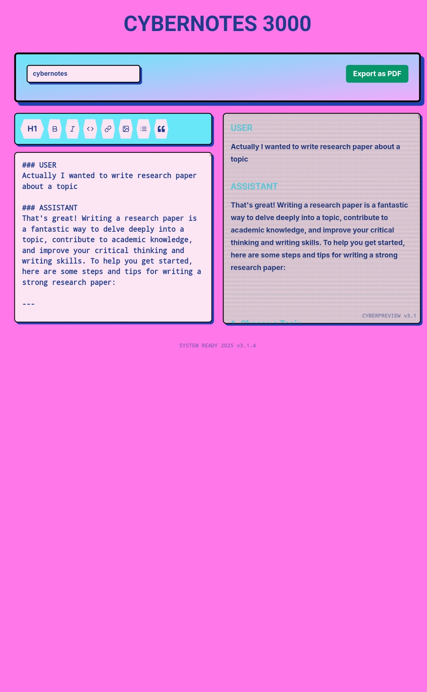

# 🚀 CyberNotes - Retro-Futuristic Markdown Editor

 

A 90s-inspired cyberpunk markdown editor with live preview and PDF export functionality. Built with Next.js, Tailwind CSS, and TypeScript.

---

## ✨ Features

- **Retro-Futuristic UI** - Neon colors, cassette tape buttons, and CRT effects
- **Real-time Markdown Preview** - See your formatted content as you type
- **PDF Export** - Generate printable PDFs with one click
- **Local Storage** - Automatically saves your work
- **Responsive Design** - Works on desktop and mobile
- **Themes** - Cyberpunk aesthetic with customizable colors

---

## 🛠️ Tech Stack

- **Framework**: [Next.js](https://nextjs.org/) (App Router)
- **Styling**: [Tailwind CSS](https://tailwindcss.com/) with custom animations
- **Markdown Processing**: [marked.js](https://marked.js.org/)
- **PDF Generation**: [html2pdf] API (https://ekoopmans.github.io/html2pdf.js/)
- **Icons**: [React Icons](https://react-icons.github.io/react-icons/)
- **Type Safety**: TypeScript

---

## 🚀 Getting Started

### Prerequisites

- Node.js v18+
- npm / pnpm / yarn

### Installation

```bash
# Clone the repository
git clone https://github.com/MohammedKaif037/CodeCircuit-MD.git
cd cybernotes

# Install dependencies
npm install          # or pnpm install or yarn install

# Run the development server
npm run dev          # or pnpm dev or yarn dev
````

Visit [http://localhost:3000](http://localhost:3000) to view the app.

---


## 🎨 Customization

### Themes

Modify colors in `tailwind.config.js`:

```js
theme: {
  extend: {
    colors: {
      cyberpink: '#ff77e9',
      cyberblue: '#1e3a8a',
      cybershadow: '#1e40af',
      cybercyan: '#67e8f9'
    }
  }
}
```

### Fonts

Edit `globals.css` to change fonts:

```css
@import url('https://fonts.googleapis.com/css2?family=Bungee&family=Press+Start+2P&display=swap');
```

---

## 📦 Building for Production

```bash
npm run build       # or pnpm build or yarn build
```

---

## 🌐 Deployment

Deploy with **Vercel**:

[](https://vercel.com/new/clone?repository-url=https%3A%2F%2Fgithub.com%2Fyour-username%2Fcybernotes)

Deploy with **Netlify**:

[](https://app.netlify.com/start/deploy?repository=https://github.com/your-username/cybernotes)

---

## 🔗 Live Demo

[Visit CyberNotes on Netlify](https://code-circuit-md.netlify.app/)
---

## 🤝 Contributing

```bash
# Fork the repository
# Create your branch
git checkout -b feature/YourFeatureName

# Commit your changes
git commit -m "Add YourFeatureName"

# Push to your branch
git push origin feature/YourFeatureName

# Submit a Pull Request
```

---


## 📧 Contact

**Mohammed Kaif**: [kaifmohammed037@gmail.com](mailto:kaifmohammed037@gmail.com)-LinkedIn:[linkedin.com/in/mohammed-kaif037](https://www.linkedin.com/in/mohammed-kaif-a7793923a?utm_source=share&utm_campaign=share_via&utm_content=profile&utm_medium=android_app)

**Project Link**: [GithubLink](https://github.com/MohammedKaif037/CodeCircuit-MD)


